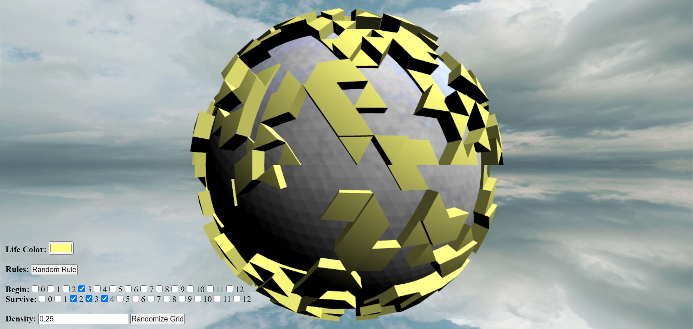
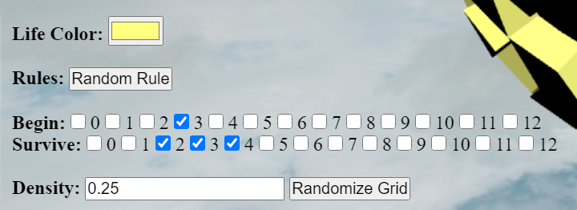

# WebGL Low-Level Demo

The Game of Life on the surface of a sphere

[Live demo running on GitHub Pages](https://comprosoftceo.github.io/GOL-WebGL/)

<br />

## About



This low-level WebGL project plays out [Conway's Game of Life](https://en.wikipedia.org/wiki/Conway%27s_Game_of_Life) on the surface of a sphere.
Although the Game of Life is usually done on a square grid, this program plays out on a triangular grid.
As such, cells have a total of 12 neighbors (instead of 8) which share a common vertex. Each cell in this triangular grid is either dead or alive.
To compute the next state of alive and dead cells, the program uses a rule to determine how cells will change:
The rule has two parts: `Begin` and `Survive`.
For example:

- **Begin:** 1, 2, 3 - Any dead cells that have 1, 2, or 3 live cell neighbors will turn into a live cell this iteration. Otherwise, they will stay a dead cell.
- **Survive:** 4, 5, 6 - Any live cells that have 4, 5, or 6 live cell neighbors will stay alive this iteration. Otherwise, they will turn into a dead cell.

By chaning these simple rules, we can generate all kinds of cool life patterns.
Computing the new state of all cells in the grid is called the next `Generation`.

<br />

## WebGL Elements

The program uses the following elements of WebGL programming to create this image:

- Static 3D models for the sphere itself
- Dynamic 3D models for the life cells
- Perspective camera
- Directional lighting and ambient lighting
- UV-mapping to draw an ice texture on the surface of the sphere
- Basic skybox for the background

The program actually uses three shaders to draw the sphere:

1. Sphere - Uses a flat shading technique to make the surface look like a golf ball.
2. Life Cells - Dynamically scales the height of the cells to create animation. This uses smooth shading for the light.
3. Skybox Background - Uses a cube texture to draw the skybox

_Note: Unfortunately, the life cells shader doesn't account for the shadow of the sphere, which is why the lighting looks off on the dark side of the sphere._
_I determined that implementing a full shadow system was beyond the scope of this project._

<br />

## Web Controls



In the bottom-left corner of the screen are controls that can be used to interact with the demo:

- "Life Color" Button - Change the color of the life cells on the sphere
- "Random Rule" Button - Pick a random rule for how cells live and survive
- "Begin" Checkboxes - If checked, dead cells with this many live neighbors will become alive the next round. Otherwise, they will stay dead.
- "Survive" Checkboxes - If checked, live cells with this many live neighbors will stay alive the next round. Otherwise, they will die.
- "Randomize Grid" Button - Put new cells into the grid with a given cell density between 0.0 and 1.0

<br />

## Compiling and Running

Be sure you have [npm](https://docs.npmjs.com/downloading-and-installing-node-js-and-npm) installed to compile and run the source code.
You should be able to install both `nvm` and `npm` using the package manager on your Linux distribution.
Or, if you are on Windows, you can also run this project using [Windows Subsystem for Linux](https://docs.microsoft.com/en-us/windows/wsl/install-win10),
which runs a Linux distribution internally.

After cloning the repository, you will need to install all of the necessary dependencies by running:

```bash
npm install
```

The project uses [Webpack](https://webpack.js.org/) to bundle all of the code files together.
If you wish to run the project on your local computer, run:

```bash
npm start
```

Otherwise, you can build static files using the command:

```bash
npm run build
```

All output files will be in the `build/` directory, which can be hosted on a static website.

<br />

## Libraries and Assets Used

The source code is written using [TypeScript](https://www.typescriptlang.org/) to add static typing to JavaScript.
As such, it must be compiled and bundled by Webpack before it can be run by the browser.
[Babel](https://babeljs.io/) is used to transpile the JavaScript code to be compatible with older browsers.
This project also uses [ESLint](https://eslint.org/) and [Prettier](https://prettier.io/) to run static analysis on the code.

The source code is written in pure WebGL, although it also uses the following libraries:

- `icosphere` - Generate a sphere approximation using a [Geodesic Polyhedron](https://en.wikipedia.org/wiki/Geodesic_polyhedron)
- `gl-matrix` - Matrix library for use with WebGL
- `color` - Handles conversion between different color strings and types
- `lodash` - Additional helper functions for JavaScript

All of the other libraries listed in `package.json` are used by Webpack, TypeScript, ESLint, and Prettier.

Both the sphere texture and the skybox cube texture are from [OpenGameArt](https://opengameart.org/).

<br />

## Project Structure

- `/img` - All images and textures used for the demo
- `/src` - TypeScript source code files
- `/shaders` - GLSL shaders used by WebGL
- `/build` - Output directory if you compile the project using `npm run build`

Source code files:

- `camera.ts` - Encapsulates a perspective camera
- `dom.ts` - Handles all interactions with the web page controls
- `index.ts` - Entry point that sets up the program
- `index.html` - Template file for the main web page
- `life.ts` - Stores the rules and logic for computing life generations on a triangular grid
- `lifeSphere.ts` - Draws the life cells on the surface of the sphere
- `light.ts` - Stores directional light and ambient light classes
- `skybox.ts` - Draws the skybox in the background
- `sphere.ts` - Draws the geodesic polyhedron in the scene
- `utils.ts` - Other helper functions used by the source code

Other configuration files:

- `webpack.config.js` - [Webpack](https://webpack.js.org/) configuration file
- `tsconfig.json` - [TypeScript](https://www.typescriptlang.org/) configuration file
- `.babelrc` - [Babel](https://babeljs.io/) transpiler configuration
- `.eslintrc.json` and `.eslintignore` - [ESLint](https://eslint.org/) configuration files
- `.prettierrc` and `.prettierignore` - Configure [Prettier](https://prettier.io/) for code formatting
